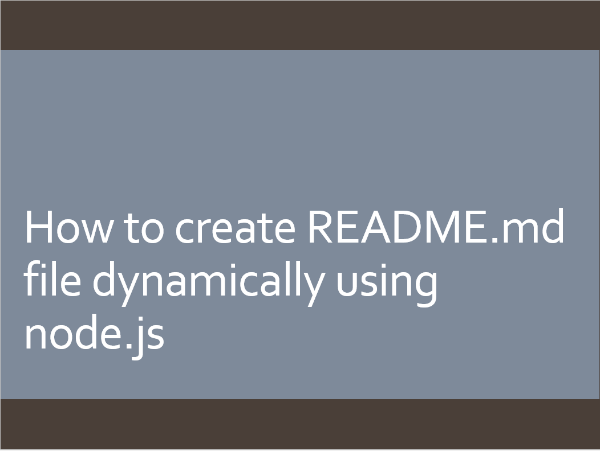

## The Title of The Project : webmestro
## Description:
 This app is learning solution for students.This websites provides two types of leaarning styles for students which is video and documentation, so students do not need to spend lots of time for searching on web.
## Table of contents are 
1. [--> Installation](#installation)
2. [--> Usage](#usage)
3. [--> License](#license)
4. [--> Contributors](#contributor)
5. [--> Tests](#test)
6. [--> Questions](#question) 
## Installation 
 no installation steps required
## Usage 
  You can click on the link below to watch video on how to access website. https://www.youtube.com/watch?v=nhLsuEuOuJc 
  
## License 
  
## Contributor 
 there are 5 contributors of this project
## Test 
 no testing required
## Question 
 **Github username**: harpreet17594 
 **User Email id**: harpreetvirdi@gmail.com
## Copyright 
 (C) copyright webmestro 2013